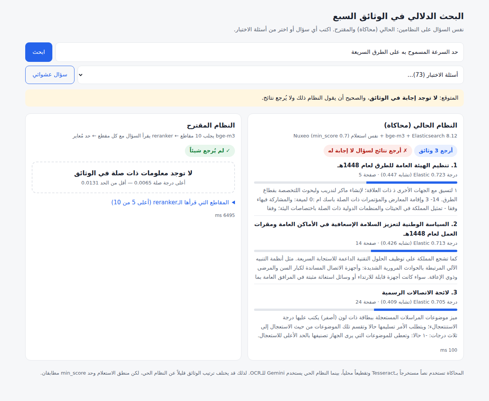

# Demo: the current system next to the proposed one

A web page where you type any question and see, side by side:

- **The current system (simulated)**: bge-m3 vectors in Elasticsearch 8.12,
  queried with **the same knn query Nuxeo sends** (nested chunk vectors,
  `score_mode: max`, `num_candidates: 100`, `min_score: 0.7`). Nuxeo's
  ACL/type/trash filters and facet aggregations are left out. They don't
  change the ranking of these 7 documents.
- **The proposed system**: bge-m3 fetches the 10 nearest chunks,
  `bge-reranker-v2-m3` reads the question and each chunk together, and the
  page shows the answer from the best chunk if its score clears the
  calibrated threshold (0.0131). Otherwise it says **«لا توجد معلومات ذات
  صلة في الوثائق»**.

For the 73 test questions, the page also shows what the right outcome is and
whether each system got it.

| question with no answer in the documents | question with an answer |
|---|---|
|  |  |

## Results through the demo API (`qa_demo.py`, all 73 questions)

| | answerable: right document first | unanswerable: nothing returned | total |
|---|---|---|---|
| current system (simulated) | 55/57 | 2/16 | 57/73 (78.1%) |
| proposed system | 56/57 | **16/16** | **72/73 (98.6%)** |

Full reports, in the live QA layout: `qa_demo_live_sim.txt`,
`qa_demo_proposed.txt`. The proposed system uses one fixed threshold, 0.0131,
fitted on these same 73 questions, so 72/73 is optimistic. The
cross-validated estimate for new questions is 97.3% (`experiment/`).

## How close is the simulation to the live system?

Measured on the 73 test questions against the live run of 2026-10-07
(`validate_live_sim.py`):

| | simulation | live system |
|---|---|---|
| same top document as live | 55/73 | – |
| answerable: right document first | 55/57 | 45/57 |
| unanswerable: returned nothing | 2/16 | 4/16 |

The query logic and `min_score` behave the same way. Both systems return
results for most questions the documents can't answer. The difference on
answerable questions comes from the **index content**: the live system's
text comes from **Gemini OCR** and Nuxeo's chunking, the simulation's from
Tesseract and local chunking. To get closer, put the Gemini OCR text in
`experiment/data/pages.jsonl` (one `{"doc", "page", "text"}` per line),
rerun `python experiment/build_index.py bge_m3 bge_m3_no_title`, and delete
the Elasticsearch index so the server rebuilds it.

## Running it with Docker (no Python setup)

You need only Docker and about 12 GB of free disk (Elasticsearch about 2 GB,
demo image 9.3 GB unpacked / 3.2 GB download, both models included). Leave
**8 GB of RAM** for Docker.

```bash
# download just this file (or use it from a checkout of the repo)
docker compose -f demo/docker-compose.yml up -d
# open http://localhost:8000   (first start: about a minute to load the models)
docker compose -f demo/docker-compose.yml down     # stop
```

The image `ghcr.io/asemdreibati/semantic-search-demo:latest` is public, so no
login is needed. `.github/workflows/demo-image.yml` rebuilds and republishes
it on every push that touches the demo.

To build the image yourself instead (about 6 GB of downloads, 10–20 minutes):

```bash
docker compose -f demo/docker-compose.yml -f demo/docker-compose.build.yml up -d --build
```

Behind a corporate proxy that inspects TLS, pass its CA certificate to the
build: `docker build --secret id=extra_ca,src=proxy-ca.crt -f demo/Dockerfile .`

## Running it without Docker

Requirements: Python 3.10+, Docker (for Elasticsearch), about 6 GB of RAM
for the two models, and about 5 GB of disk for model downloads.

```bash
# 1. Elasticsearch 8.12, same major/minor as production
docker run -d --name es812 -p 9200:9200 \
  -e discovery.type=single-node -e xpack.security.enabled=false \
  -e ES_JAVA_OPTS="-Xms2g -Xmx2g" \
  docker.elastic.co/elasticsearch/elasticsearch:8.12.2

# 2. Python packages
pip install fastapi uvicorn requests numpy sentence-transformers transformers sentencepiece
pip install torch --index-url https://download.pytorch.org/whl/cpu   # or the CUDA build

# 3. Start the demo (first start downloads BAAI/bge-m3 and
#    BAAI/bge-reranker-v2-m3 from Hugging Face and builds the index)
python demo/server.py
# open http://127.0.0.1:8000
```

Environment variables: `ES_URL` (default `http://127.0.0.1:9200`),
`ES_INDEX` (`nuxeo_sim`), `BGE_M3_DIR` / `RERANKER_DIR` (local model
folders instead of Hugging Face), `RERANK_TOP_K` (10), `HOST`, `PORT`.

**Speed.** The live column answers in about 0.1 s. The proposed column runs
the reranker on 10 chunks. With a GPU it is detected automatically (fp16)
and takes tens of milliseconds. On CPU it runs in full precision: a few
seconds on a laptop, about 10 s on a 4-core VM. `RERANKER_INT8=1` makes it
about 10× faster. But int8 moves the very small probabilities around the
0.0131 threshold by 3–4×, and on the test set the proposed pipeline drops
from 71/73 to 68/73. Use it only for a quick look, not for measurements.
`RERANK_TOP_K=5` halves the time and kept the same accuracy on the test set.
fp16 on GPU was not measured here. After switching hardware, run
`python demo/qa_demo.py` once to confirm the scores still give the same
results.

## The API

`POST /v1/query/search` takes `{"query": "...", "pipeline": "live" | "proposed"}`
and answers in the same shape as the live API:
`{"hits": [{"score", "citation": {"docId", "subject"}, "text", "page"}], "total"}`.
The proposed pipeline returns an empty `hits` list when there is no
relevant information. Existing QA scripts can therefore point at the demo,
e.g. `python demo/qa_demo.py`, which writes `qa_demo_live_sim.txt` and
`qa_demo_proposed.txt` in the live QA report layout.

| file | what it does |
|---|---|
| `engine.py` | both pipelines, index build, the Nuxeo query |
| `server.py` | web server + API |
| `index.html` | the comparison page |
| `validate_live_sim.py` | simulation vs the real live run |
| `qa_demo.py` | full test set through the API, live-run report layout |
| `Dockerfile`, `docker-compose.yml`, `docker-compose.build.yml` | the container setup |
